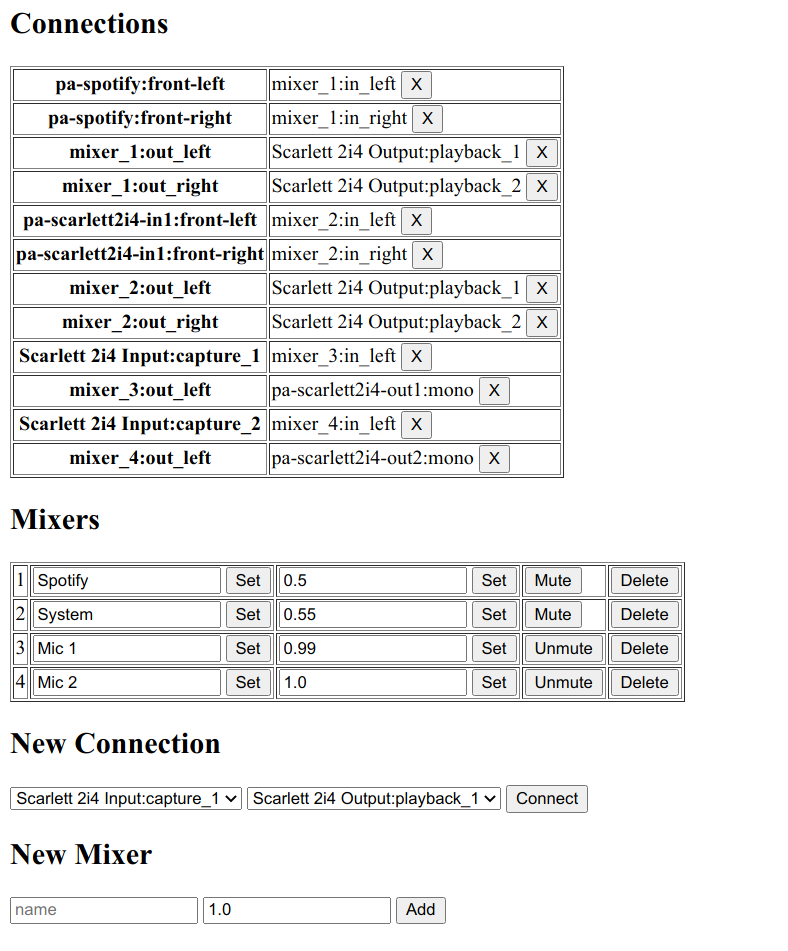

# Jackie

Jackd setup/controll stuff

## Why

Manages ALSA in- and outputs, mixers and includes a connection manager with persistent connections

This is intended for relatively static workstation setups where most stuff only supports pulseaudio anyway,
it's probably unusable if a DAW wants to handle its own connections etc.

Existing tools seemed to be target mostly at studio setups and were waaay too complicated for everyday desktop use.

## Webinterface

The webinterface is only intended for setup, I integrated most controls into hotkeys and my custom i3bar scripts

